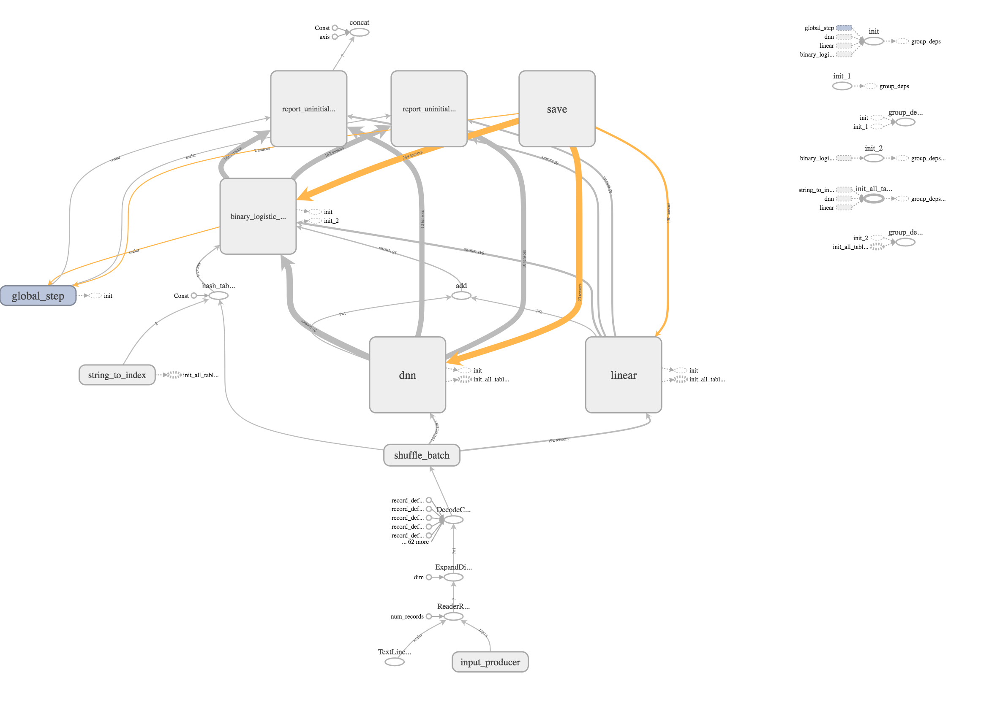

# deepneuralnet-chess
Given a chess position as input, predict the most likely result of the game.

This branch is an attempt to use TensorFlow and the Google Cloud Machine Learning Engine to train a model.




**Installation**

```
pip install -r requirements.txt
```

In addition to the dependencies, you will need to download the [Google Cloud SDK](https://cloud.google.com/sdk/) if you plan on running ` gcloud ` commands yourself.

**Data**

The data used to train the model was downloaded from [lichess.org](https://database.lichess.org/). We of course will need to process this data in a format that TensorFlow can understand.

*Step 1*

After downloading the dataset from lichess and decompressing it, we need to remove the unnecessary information such as player names, event names, time stamps, variations, comments, etc. The only information we want is the *final* position of the game. I used a tool called [pgn-extract](https://www.cs.kent.ac.uk/people/staff/djb/pgn-extract/) from the University of Kent to accomplish this.

Simply execute:

```
pgn-extract --nocomments --notags --novars --nomovenumbers -F -#500000,100 <filename.pgn>
```

This command will read through <filename.pgn>, remove the unnecessary data, and output new .pgn files of 500,000 games each, starting with name 1.pgn and incrementing until there are no more matches returned from the command.

If you want to know more about the pgn-extract tool, the documentation can be found on the University of Kent's CS department website [here](https://www.cs.kent.ac.uk/people/staff/djb/pgn-extract/help.html).

Now each file looks like this...

```
e4 e5 Bc4 Nc6 Qh5 Nf6?? Qxf7# { "r1bqkb1r/pppp1Qpp/2n2n2/4p3/2B1P3/8/PPPP1PPP/RNB1K1NR w KQkq -" } 1-0
```

We can use python to extract the position and result:

```
python process.py --files $filenames
```

The process.py script will go through each file in *filenames* and perform steps to extract the FEN position string and result from each game. A new file will be created in the working directory entitled "*filename*.pgn_processed.csv" which will contain 67 columns (64 squares, who's move it is, the position in FEN format, and the result of the game). Each row corresponds to one chess position.


**Training**

The model was trained on 97,364,461 chess positions. After training, the model achieved accuracy ` 0.7505 `.

To train the model on the Google Cloud Machine Learning engine, run something similar to the following command:

```
gcloud ml-engine jobs submit training $JOB_NAME --job-dir $OUTPUT_PATH --runtime-version 1.2 --module-name trainer.task --package-path trainer/ --region "us-central1" -- --train-files $PATH_TO_TRAIN_FILES --eval-files $PATH_TO_EVAL_FILES --train-steps 3000 --verbosity DEBUG
```

**Results**

*Step 1:*

```
Saving dict for global step 1: accuracy = 0.50825,
accuracy/baseline_label_mean = 0.5455, accuracy/threshold_0.500000_mean = 0.50825,
auc = 0.595211, auc_precision_recall = 0.593054, global_step = 1,
labels/actual_label_mean = 0.5455, labels/prediction_mean = 0.556439, loss = 0.672039, precision/positive_threshold_0.500000_mean = 0.531124, recall/positive_threshold_0.500000_mean = 0.902989
```

*Step 3000:*

```
Saving dict for global step 3000: accuracy = 0.7505,
accuracy/baseline_label_mean = 0.5455, accuracy/threshold_0.500000_mean = 0.7505,
auc = 0.854234, auc_precision_recall = 0.85503, global_step = 3000,
labels/actual_label_mean = 0.5455, labels/prediction_mean = 0.536037, loss = 0.434461, precision/positive_threshold_0.500000_mean = 0.764544, recall/positive_threshold_0.500000_mean = 0.817736
```
